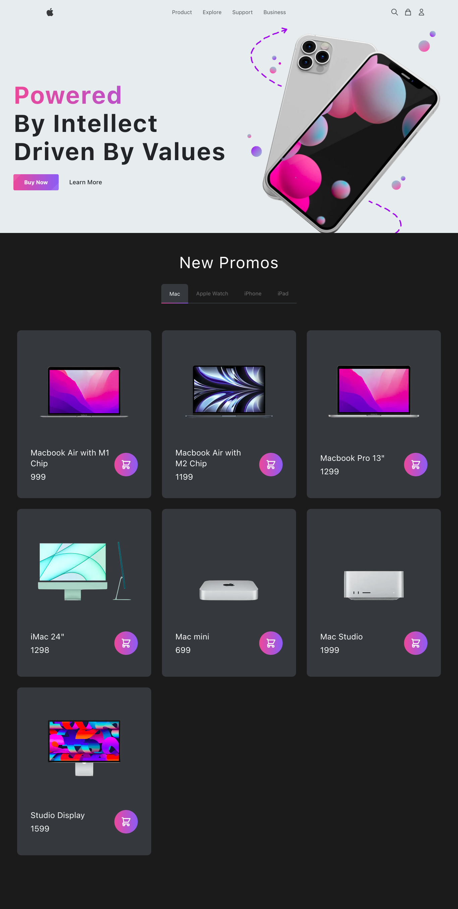

<div align="center">
  
</div>

<h1 align="center">
 Apple Store, E-Commerce
</h1>

In the Apple Store powered by Next.js, users can browse and explore the store's products, add items to a shopping cart, and checkout using the Stripe payment service.

To ensure a fluid and responsive user experience, Next.js and TypeScript technologies were used. Sanity.io was chosen to manage the content of the products, while Stripe handles payment processing.

The project also features Headless UI for creating interface components, which brings flexibility and customization in the application's styling. State management is done with Redux, ensuring that shopping cart information is securely stored and updated in real time.

For user authentication, the Next Auth library was used, which allows integration with different authentication providers, such as Google and Facebook.

Finally, the Next.js Routes API was used to create custom routes and ensure the backend runs efficiently. With this technology, it is possible to create customized API endpoints, which allow access to server data in an organized and structured way.

## :hammer_and_wrench: Tools

### Frontend

* Next.js
* TypeScript
* Sanity.io
* Stripe
* Headless UI
* Redux
* Next Auth
* API Routes

## :mailbox_with_mail: Utilities
 
### Sanity.io 

Sanity.io is an open source content management system (CMS) that allows developers to create custom and flexible editing interfaces to manage the content of a website or application. It provides a platform to store, manage and deliver content to multiple platforms and output channels such as websites, mobile apps and desktop devices.

The Sanity.io platform offers a flexible content framework that allows you to create custom content templates to meet the needs of a specific project. Content templates are created using Sanity Studio, a visual tool for creating and managing content.

With Sanity.io, developers can build custom, scalable, and secure content management solutions without the constraints of traditional CMS. It provides a secure and scalable content API for web and mobile applications, enabling developers to create personalized user experiences with real-time, manageable content.

### Next Auth

Next Auth is an authentication library for Next.js that simplifies the process of authenticating users in web applications. It provides an easy and flexible solution for authentication using various authentication strategies like Google, Facebook, Twitter, Github, etc., as well as custom authentication.

Next Auth takes care of many aspects of user authentication, including verifying credentials, generating and storing authentication tokens, managing sessions, redirecting authenticated users, and more.

The library is easy to configure and customize and allows developers to create a seamless authentication experience for their Next.js applications. It supports multiple identity providers, databases, and content management systems, making it a popular choice for many projects.

### API Routes

The Routes API is a Next.js feature that allows the creation of API routes in the Next.js project itself, without the need to configure a separate server to handle API requests. With the Routes API, you can create API routes as JavaScript files in the pages/api directory of the Next.js project.

When creating an API route with the Routes API of Next.js, the developer has access to the req object (HTTP request object) and the res object (HTTP response object), which can be used to manipulate the request data and send the response to the client. It is possible to create API routes for different types of HTTP requests, such as GET, POST, PUT and DELETE.

One of the advantages of the Routes API is that it allows the developer to create API routes with the same folder and file structure as the rest of the Next.js project, making code organization easier. Additionally, the Routes API supports the use of middleware libraries such as body-parser to process the request body.

With the Routes API, the developer can easily build a complete RESTful API, including authentication, authorization, and data validation. In addition, Next.js' Routes API has native integration with other framework features, such as getStaticProps and getServerSideProps, allowing the developer to create API routes that use Next.js static generation and server-side rendering features.

## :speech_balloon: Explanations

### Sanity.io (Content Management System)

In this project, Sanity.io was used as a CMS, which allows you to create, edit, manage and publish content on digital platforms, allowing it to be modified, removed and added without the need to know the HTML markup language. Incorporating a Content Management System in our websites allows us to have a better management of the content of our website, so we don't need to leave this entire management system attached to the website, so all CRUD and content access permissions adopt an external service designed on this.

To embed Sanity.io in your project we must first have globally installed its Command Line Interface: `npm install -g @sanity/cli`. With CLI Tooling installed, we can start implementing Sanity.io to the project with `sanity init`, right after the initial configurations are started we will have a directory where we can access the Sanity Studio development server, to access it execute `sanity start` inside the studio directory.

#### Sanity Studio Directory

The `schema.js` file inside the `schemas` directory is where we will build the content model, how its information will be stored and presented in Sanity Studio, as well as the relationship between other documents and contents. Our schema is defined through a structured Javascript Object with its proper properties and values, in which other documents can have fields that refer to other documents:

```js
// studio/schemas/product.js
import { RiMacbookLine } from 'react-icons/ri'

export default {
  name: 'product',
  title: 'Product',
  type: 'document',
  icon: RiMacbookLine,
  fields: [
    {
      name: 'title',
      title: 'Title',
      type: 'string',
    },
    {
      name: 'slug',
      title: 'Slug',
      type: 'slug',
      options: {
        source: 'title',
        maxLength: 96,
      },
    },
    {
      name: 'image',
      title: 'Image',
      type: 'array',
      of: [{ type: 'image' }],
      options: {
        hotspot: true,
      },
    },
    {
      name: 'category',
      title: 'Category',
      type: 'reference',
      to: [{ type: 'category' }],
    },
    {
      name: 'price',
      title: 'Price',
      type: 'number',
    },
    {
      name: 'description',
      title: 'Description',
      type: 'blockContent',
    },
  ],
}
```

#### Query Language (GROQ)

GROQ is Sanity's open-source query language. It's a powerful and intuitive language that's easy to learn. With GROQ you can describe exactly what information your application needs, join information from several sets of documents, and stitch together a very specific response with only the exact fields you need. 

With GROQ queries we can make requests to Sanity Studio through the api route:

```ts
// pages/api/getProducts.ts
import type { NextApiRequest, NextApiResponse } from 'next'
import { groq } from 'next-sanity'
import { sanityClient } from '../../sanity'

const query = groq`*[_type == "product"] {
_id,
  ...
} | order(_createdAt asc)`

type Data = {
  products: Product[]
}

export default async function handler(
  req: NextApiRequest,
  res: NextApiResponse<Data>
) {
  const products: Product[] = await sanityClient.fetch(query)
  res.status(200).json({ products })
}
```

While the api route is responsible for performing queries and communicating with the CMS, the `utils` directory is responsible for acquiring this data by making the request to the desired endpoints:

```ts
// utils/fetchProducts.ts 
export const fetchProducts = async () => {
  const res = await fetch(`${process.env.NEXT_PUBLIC_BASE_URL}/api/getProducts`)

  const data = await res.json()
  const products: Product[] = data.products

  return products
}
```

<br />

### Server-Side Rendering

With the export of the getServerSideProps function to Next.js you will pre-render this page on each request using the data returned by getServerSideProps. This is useful if you want to fetch data that changes frequently and make the page to be for updated the most current data. This is necessary in an E-commerce context because we do not want a product that is no longer selling visible on the page, allowing even its purchase. The getServerSideProps function returns properties that must be consumed by the page component.

```ts
// pages/index.tsx
export const getServerSideProps: GetServerSideProps<Props> = async (
  context
) => {
  const categories = await fetchCategories()
  const products = await fetchProducts()
  const session = await getSession(context)

  return {
    props: {
      categories,
      products,
      session,
    },
  }
}
```

<br />

### Redux Toolkit

Redux is a pattern and library for managing and updating application state, using events called "actions". It serves as a centralized store for state that needs to be used across your entire application, with rules ensuring that the state can only be updated in a predictable fashion.

#### The Redux Store

The center of every Redux application is the store. A `store` is a container that holds your application's global state.

A store is a JavaScript object with a few special functions and abilities that make it different than a plain global object:

* You must never directly modify or change the state that is kept inside the Redux store
* Instead, the only way to cause an update to the state is to create a plain action object that describes "something that happened in the application", and then dispatch the action to the store to tell it what happened.
* When an action is dispatched, the store runs the root reducer function, and lets it calculate the new state based on the old state and the action
* Finally, the store notifies subscribers that the state has been updated so the UI can be updated with the new data.

```ts
// redux/store.ts 
import { configureStore } from '@reduxjs/toolkit'
import basketReducer from './basketSlice'

export const store = configureStore({
  reducer: {
    basket: basketReducer,
  },
})
```

#### Reducers

Reducers are functions that take the current state and an action as arguments, and return a new state result. In other words, (state, action) => newState.

#### createSlice

A function that accepts an initial state, an object of reducer functions, and a slice name, and automatically generates action creators and action types that correspond to the reducers and state.

This API is the standard approach for writing Redux logic.

Internally, it uses createAction and createReducer, so you may also use Immer to write "mutating" immutable updates:

```ts
// redux/basketSlice.ts 
const initialState: BasketState = {
  items: [],
}

// Setters
export const basketSlice = createSlice({
  name: 'basket',
  initialState,
  reducers: {
    addToBasket: (state: BasketState, action: PayloadAction<Product>) => {
      state.items = [...state.items, action.payload]
    },
    removeFromBasket: (
      state: BasketState,
      action: PayloadAction<{ id: string }>
    ) => {
      const index = state.items.findIndex(
        (item: Product) => item._id === action.payload.id
      )

      let newBasket = [...state.items]

      if (index >= 0) {
        newBasket.splice(index, 1)
      } else {
        console.log(
          `Cant remove product (id: ${action.payload.id}) as its not in basket!`
        )
      }

      state.items = newBasket
    },
  },
})

// Action creators are generated for each case reducer function
export const { addToBasket, removeFromBasket } = basketSlice.actions

// Selectors -> retrieving items in state to use in different components
export const selectBasketItems = (state: RootState) => state.basket.items
export const selectBasketItemsWithId = (state: RootState, id: string) => {
  state.basket.items.filter((item: Product) => item._id === id)
}
export const selectBasketTotal = (state: RootState) =>
  state.basket.items.reduce(
    (total: number, item: Product) => (total += item.price),
    0
  )
export default basketSlice.reducer
```

<br />

### Stripe: Prebuilt Checkout page (server-side)

Stripe is a <strong>payments infrastructure</strong> designed for developers that brings together everything needed to build websites and apps that accept payments and send payments, Stripe makes moving money simple, borderless, programmable on a global scale.

#### Installation of Stripe libraries:

`npm install --save stripe @stripe/stripe-js`

#### Create a Checkout Session & Supply success and cancel URLs
 
Create an endpoint on the server that creates a Checkout Session. A Checkout Session controls what your customer sees on the checkout page such as line items, order amount, acceptable payment methods. Stripe allows cards and other common payment methods by default, and we can enable or disable payment methods directly in the Stripe Dashboard.

Specify URLs for success and cancel pages—make sure they’re publicly accessible so Stripe can redirect customers to them. You can also handle both the success and canceled states with the same URL.

```ts
// pages/api/checkout_sessions.ts 
import type { NextApiRequest, NextApiResponse } from 'next'
import Stripe from 'stripe'
const stripe = new Stripe(process.env.STRIPE_SECRET_KEY!, {
  // https://github.com/stripe/stripe-node#configuration
  apiVersion: '2022-08-01',
})

// Create checkout sessions from body params
const params: Stripe.Checkout.SessionCreateParams = {
  payment_method_types: ['card'],
  // Define a product to sell in line_items
  line_items: transformedItems,
  payment_intent_data: {},
  mode: 'payment',
  success_url: `${req.headers.origin}/success?session_id={CHECKOUT_SESSION_ID}`,
  cancel_url: `${req.headers.origin}/checkout`,
  metadata: {
    images: JSON.stringify(items.map((item) => item.image[0].asset.url)),
  },
}
const checkoutSession: Stripe.Checkout.Session =
  await stripe.checkout.sessions.create(params)

res.status(200).json(checkoutSession)
```
 
#### Define a product to sell

Always keep confidential information about your product inventory, such as price and availability, on your server to avoid manipulation of the customer's client. Set the product information when you create the Checkout Session using predefined price IDs or in real time with price_data:

```ts
// pages/api/checkout_sessions.ts 
// This is the shape in which stripe expects the data to be
const transformedItems = items.map((item) => ({
  price_data: {
    currency: 'usd',
    product_data: {
      name: item.title,
      images: [urlFor(item.image[0]).url()],
    },
    unit_amount: item.price * 100,
  },
  quantity: 1,
}))
```

<br />

### Stripe: Build your checkout (client-side)

#### Add an order preview page

Add a file under `pages/` to create a page showing a preview of the customer's order. Allow them to review or modify their order—as soon as they’re sent to the Checkout page, the order is final and they can’t modify it without creating a new Checkout Session.

#### Load Stripe.js

Stripe Checkout relies on Stripe.js, Stripe’s foundational JavaScript library for collecting sensitive payment information with advanced fraud detection. Call loadStripe with your publishable API key. It returns a Promise that resolves with the Stripe object as soon as Stripe.js loads.


```ts
// utils/get-stripejs.ts 
import { loadStripe, Stripe } from '@stripe/stripe-js'

// https://vercel.com/guides/getting-started-with-nextjs-typescript-stripe#loading-stripe.js
// Singleton Pattern
let stripePromise: Promise<Stripe | null>
const getStripe = () => {
  if (!stripePromise) {
    stripePromise = loadStripe(process.env.NEXT_PUBLIC_STRIPE_PUBLISHABLE_KEY!)
  }
  return stripePromise
}

export default getStripe
```

#### Fetch a Checkout Session

Make a request to the endpoint on your server to redirect the customer to a new Checkout Session when they click on the Checkout button.

```tsx
// pages/checkout.tsx
const createCheckoutSession = async () => {
    setLoading(true)

    const checkoutSession: Stripe.Checkout.Session = await fetchPostJSON(
      '/api/checkout_sessions',
      {
        items: items,
      }
    )

    // Internal Server Error
    if ((checkoutSession as any).statusCode === 500) {
      console.error((checkoutSession as any).message)
      return
    }

    // Redirect to checkout
    const stripe = await getStripe()
    const { error } = await stripe!.redirectToCheckout({
      // Make the id field from the Checkout Session creation API response
      // available to this file, so you can provide it as parameter here
      // instead of the {{CHECKOUT_SESSION_ID}} placeholder.
      sessionId: checkoutSession.id,
    })

    // If `redirectToCheckout` fails due to a browser or network
    // error, display the localized error message to your customer
    // using `error.message`.
    console.warn(error.message)

    setLoading(false)
  }
```

#### Add a checkout button

Add a button to your order preview page. When your customer clicks it, they’re redirected to the Stripe-hosted payment form.

```tsx
 <Button
  noIcon
  loading={loading}
  title="Check Out"
  width="w-full"
  onClick={createCheckoutSession}
/>
```



<p align="center">Project made with :blue_heart: by <a href="https://github.com/stardusteight-d4c">Gabriel Sena</a> and <a href="https://www.youtube.com/@ilwyennefer">ILW Yennefer</a></p>
